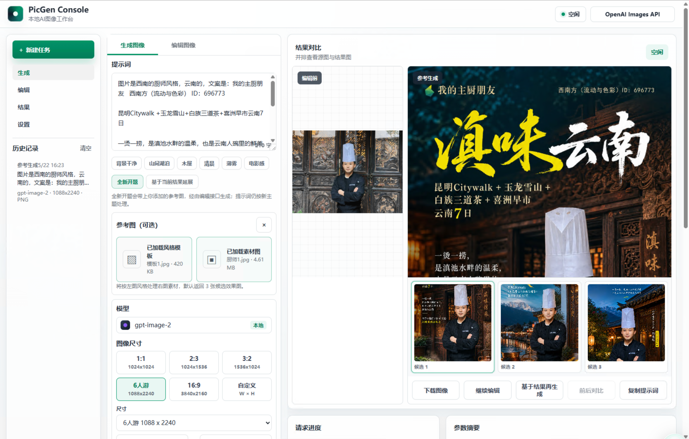

# PicGen Console

一个面向 OpenAI 兼容图像生成 / 编辑接口的本地工作台，当前版本 **0.1.64**。它把
`/v1/images/generations`、`/v1/images/edits` 与 `/v1/responses`（含 `image_generation` 工具）
包装成统一可观测的代理，前端是一套零依赖的 Web 控制台。

适合场景：

- 本地图像 / 编辑日常实验
- 私有部署，对接兼容 OpenAI 协议的国内/自建上游
- 嵌入企业内部工具链，作为带审计、限流、健康检查的接口网关

## 界面预览



## 0.1.64 主要特性

- **避免重采样后的 LOGO 重复叠加**：已有官方 LOGO 即使被上游缩放并产生少量像素位移，也会在严格颜色阈值下识别并保留，不再另贴第二枚 LOGO。

- **行程图按需嵌入标题字体**：仅打包本次标题和日期实际使用的字形，保留原字体效果，同时显著降低 SVG 体积和客户浏览器解码压力。

- **简洁模式可直接接收分享**：主页新增“收到分享”区块，支持刷新并直接打开同事分享的成品；新用户无需先切换到专业模式。

- **局部改图保留蒙版外原图**：服务端按 OpenAI 蒙版语义合成最终图片，透明区域采用编辑结果；PNG 成品的非透明区域逐像素保留输入原图。

- **避免重复叠加官方 LOGO**：发现标准位置已有官方透明 PNG 时直接保留原文件，不重复贴入、不重新编码；新贴入时仍默认锁定左上标准位置，只在安全区复杂度明显改善时移动。

- **完整展示真实输出比例**：结果预览与候选缩略图使用完整包含布局，纵向或横向图片不再被工作区网格裁切。

- **正常页面刷新不再误限流**：业务 API 仍受每分钟总配额保护，5 秒 burst 只约束写请求；生成完成后的统计刷新、工作区重载和作品列表读取不会互相挤占短时写入配额。

- **多候选兼容参数路径**：上游若以 `tools[0].n` 等嵌套参数路径拒绝候选数量，自动去掉 `n` 并并发补齐候选；结构化识别只针对候选数字段，不会误重试内容审核错误。

- **上游参数错误不再误报审核**：`invalid_mask_image_format` 会提示客户改用像素尺寸一致的标准 PNG，不再仅因通用 `image_generation_user_error` 类型就提示“内容审核未通过”；明确的内容政策 code 和文案仍会正确分类。

- **Responses 候选数量收敛**：强制使用图像工具、关闭并行工具调用并把请求数量写入提示词；上游仍越界时在落盘前按 `sample_count` 截断，避免单图任务意外生成 6 张候选并拖到数百秒，同时不再为非官方 `n` 参数自动重发付费请求。

- **简洁模式尺寸提示**：上游返回不同画幅时继续保留完整原图，并在结果按钮上方直接显示请求尺寸、实际尺寸和未缩放说明；提示随结果持久化，刷新后仍可见。

- **分享成功反馈可见**：站内分享完成后，清空接收人选择不会再覆盖成功状态，客户可以明确看到实际分享人数。

- **并发认证加固**：旧密码校验、账号锁复核和会话创建绑定在同一事务中，密码重置或并发锁定后不再产生有效旧密码会话；不同格式头像并发上传也不会互相删除。
- **尺寸重试按画幅选优**：上游多次返回错误尺寸时，优先保留最接近目标画幅和尺寸的候选，不再误选像素更多但方向错误的图片；额外调用次数和失败原因会写入图片元数据。
- **前端异步状态隔离**：会话过期会取消未完成的提示词确认，候选切换会作废旧版权/文字检查，历史参数重跑不会覆盖当前工作区草稿。
- **存储与格式边界修复**：派生图写入当天目录并清理危险文件名，保留期扫描不跟随符号链接，JPEG EXIF 方向和 SVG 非法 XML 字符得到正确处理。
- **通知不再阻塞提交**：Bug 通知先记录 `pending` 后在后台更新结果，异常会被消费和记录，进程停机时执行限时收尾。

- **统一生图入口**：生成、参考图、延展和编辑统一提交 `/api/image-jobs`，由服务端根据尺寸、模式和输入图选择 Images Generate、Images Edit 或 Responses，前端不再自行猜测调用路径。
- **模型信息分权展示**：普通用户工作台不再展示或提交模型、通道、接口和思考等级；管理员高级设置可覆盖这些参数，并可在任务中心查看实际执行的 transport、model 和 reasoning effort。
- **实际执行记录一致**：任务完成时用上游真实执行信息更新 `generation_jobs`，避免页面显示 `gpt-image-2`、任务表记录 `gpt-5.5`、实际请求却使用 `gpt-5.6-sol` 的不一致。
- **精确尺寸服务端路由**：`1088x2240`、`3840x2160` 和其它合法非 Images 原生尺寸自动走 Responses + `gpt-5.6-sol` + `reasoning.effort=xhigh`；Images 原生尺寸按是否有输入图选择生成或编辑接口。
- **Responses 旧模型彻底退役**：修复 IndexedDB 工作区快照在设置迁移后再次写回 `gpt-5.5`；数据库升级到 schema v13，前端同步迁移本地设置和工作区，服务端对所有入口无条件把精确旧默认值归一化为 `gpt-5.6-sol`。
- **LOGO 标准位置优先**：官方 LOGO 默认固定在左上标准位置，只有候选区域的归一化复杂度同时达到绝对和相对改善阈值才会移动；评分覆盖扩大后的安全区，并提高 LOGO 本体区域权重，惩罚邻近文字和高密度边缘。
- **Responses 运行时配置**：现有用户保存的旧默认 `gpt-5.5` 会一次性迁移到 `gpt-5.6-sol`；默认思考等级通过 `PICGEN_DEFAULT_RESPONSES_REASONING_EFFORT` 配置，当前为 `xhigh`，无需重新改代码。
- **编辑前后文字对比**：编辑模式自动把"编辑前/编辑后"两张图分别转写并程序化比对，未被要求修改的
  文字发生变化会立即在文字一致性面板提示（个别形近字可能超出自动识别能力，面板会注明需人工复核）。
- **无标签提示词也做文字校验**：提示词里没有"标题：/亮点："等标签时（表格、自由排版很常见），
  文字一致性检查不再空转放行，而是把完整提示词原文作为文字来源逐字核对成图。
- **版本历史不再受图库规模限制**：改为按版本链查询，图片超过 200 张后新图的版本记录不再 404。
- **候选图 ID 精确对齐**：上游返回不可用候选时不再错位挂接 `generated_image_id`，杜绝反馈/收藏/LOGO
  成品写错记录；全占位响应会明确报错而不是"成功但没图"。
- **成功通知移出请求路径**：Telegram 通知改为后台发送并自动重试瞬时失败，生图完成不再被通知超时拖慢。
- **路线图排版加固**：国家大字和站点签条互不遮挡，签条不再压住其他站点的路线圆点；日期完整显示。
- **一批健壮性修复**：`.env.example` 逗号写法不再崩溃启动、空 Bearer 头返回 401 而非 500、
  上游连接被掐断正确重试、保留期清理不再提前一天删图、关闭登录时路线图/匿名保存可用等。
- **透明 LOGO 成品**：最终成品只叠加官方透明 PNG，不再因为深色或复杂背景自动绘制半透明底板；Telegram 通知默认超时提高到 15 秒并记录可诊断的失败类型。
- **标题/正文文字分层**：主标题在逐字准确和高识别度前提下，允许商业美术字、手写标题、立体描边、金属或笔刷字效；正文、地名、日期、序号、说明和贴士继续严格清晰逐字。
- **严格尺寸兜底**：普通海报、编辑图和 Responses 图像工具仍会把用户选择的 `size` 传给上游；若上游按比例降采样，PicGen 会在本地用高质量 cover fit 保存为请求的精确画布，并在响应 metadata 里保留 `upstream_actual_size` 便于排障。路线图仍可按行程内容推测构图尺寸。
- **默认最高图片质量**：OpenAI Images / Responses 图像工具默认发送 `quality: "high"`，兼容 `gpt-image-2` 的官方最高质量参数。
- **异步 + 连接池**：底层用 `httpx.AsyncClient`，含连接池、分段超时、指数退避重试。
- **类型化校验**：所有请求/响应走 Pydantic v2 模型，参数错误统一以中文报错返回。
- **结构化日志**：`logging` + 自定义格式（console / json 双模式），所有日志自动带 `request_id`，
  并对 `api_key / authorization / proxy_auth_token` 等敏感字段自动脱敏。
- **请求中间件**：
  - `RequestIdMiddleware` — 生成或透传 `X-Request-ID`
  - `SecurityHeadersMiddleware` — `X-Content-Type-Options / X-Frame-Options / Referrer-Policy / Permissions-Policy / Cache-Control`
  - `BodySizeLimitMiddleware` — 拒绝超大请求（默认 64 MB）
  - `RateLimitMiddleware` — 滑动窗口限流（默认业务 API 120 req/min + 写请求 20 burst/5s）
  - `ProxyAuthMiddleware` — 可选 Bearer / `X-Proxy-Token` 鉴权
  - `CORSMiddleware` — 配置化跨域
- **原子化落盘**：图片与 sidecar JSON 用临时文件 + rename 写入，崩溃不留半截文件；核心生成、
  反馈、分享和取图送达数据会进入 SQLite，便于管理员后续审计。
- **健康分级**：`/api/health` 仅看进程存活；`/api/ready` 联动客户端、磁盘可写性、版本号。
- **Telegram 统一通知**：可配置 Telegram Bot 接收后台/上游异常、成功生图、Bug 反馈和找回密码申请；
  消息以 `【PicGen｜分类】` 开头，Telegram 列表里可直接区分事件类型和关键标题。
- **旅行提示词标签**：生成提示词下方的快捷标签改为“高级旅行 / 精致海报 / 酒店质感 /
  山野度假 / 电影光影 / 色彩克制”，更贴近 6 人游当前常用出图方向。
- **账号自助维护**：普通用户可登录后自助修改密码；忘记密码优先走邮箱自助重置，没有邮箱或
  SMTP 不可用时仍会通知管理员，且对外保持枚举安全。
- **交付一致性**：请求集成 6 人游 LOGO 时，成品保存完成前下载按钮会进入处理中状态，避免误下无 LOGO 底图。
- **精准路线图**：AI 只负责高级漫画地图底图，最终路线、编号、日期和地点文字由程序按真实坐标覆盖；
  手动尺寸优先，只有选择“自动比例”时才会根据真实经纬度自动选择横版、竖版或方图。
- **私有文件缓存**：鉴权后的 `/files/...` 图片使用 private cache 指令，避免共享代理缓存私有交付物。
- **会话清理**：后台保留循环会定期清理过期登录会话，避免 sessions 表长期只增不减。
- **OpenAPI**：默认开启 `/api/docs`（Swagger）与 `/api/openapi.json`。
- **生产级 CLI**：支持 `--workers / --log-level / --log-format / --reload / --prune-now / --print-config`。
- **容器化**：`Dockerfile` 多层缓存 + 非 root 用户 + healthcheck；`docker-compose.yml` 直接可跑。

## 启动

### 本地（开发）

```bash
./scripts/bootstrap.sh          # uv sync
./scripts/dev.sh                # 自动重载
```

默认监听 `http://127.0.0.1:8000`，OpenAPI 文档在 `http://127.0.0.1:8000/api/docs`。

### 本地（生产单机）

```bash
./scripts/serve.sh              # 多 worker、JSON 日志
```

可通过环境变量覆盖：

```bash
PICGEN_HOST=0.0.0.0 \
PICGEN_PORT=8080 \
PICGEN_WORKERS=4 \
PICGEN_LOG_FORMAT=json \
./scripts/serve.sh
```

### Docker

```bash
docker build -t minorli/picgen:0.1.64 .
docker run --rm -p 8000:8000 \
  -v picgen-data:/app/data \
  minorli/picgen:0.1.64
```

或：

```bash
docker compose up -d
```

发布镜像按 `openai-shelf` 的 Docker Hub 命名方式：

```bash
./scripts/docker-build-push.sh
```

默认会构建并推送 `minorli/picgen:0.1.64`。也可以覆盖：

```bash
IMAGE=minorli/picgen VERSION=0.1.64 PLATFORM=linux/amd64 ./scripts/docker-build-push.sh
```

镜像不会包含 `.env`、本地用户库或历史图片。容器内置 `HEALTHCHECK` 探测 `/api/health`，以非 root
用户 `picgen` 运行。`docker-compose.yml` 使用 `picgen-data` volume 保存 `/app/data`，因此注册用户、
用量统计和落盘结果会在容器重启后继续保留。

容器内默认固定三条上游 URL：

- `https://sub.tidba.com/v1/images/generations`
- `https://sub.tidba.com/v1/images/edits`
- `https://sub.tidba.com/v1/responses`

普通用户不接触 API Key、模型或上游地址。部署时应设置全站服务端 Key：运行容器时传入
`PICGEN_DEFAULT_API_KEY`，或在持久化 volume 的 `/app/data/.env` 中写入该变量。管理员高级设置仅用于诊断或
切换自定义提供者；自定义 Key 只会发送给本次实际选中的自定义端点，不会串用到默认提供者。一个 Key 只能覆盖
同一 scheme、host 和 port 的自定义端点；多个不同提供者必须分开配置。

## 配置

所有配置走 `Pydantic Settings`，可通过环境变量或 `.env` 文件提供。完整模板见
[`.env.example`](.env.example)。容器镜像把 `PICGEN_ENV_FILE` 指向 `/app/data/.env`，便于把运行期配置
放在持久化 volume 中；源码目录里的 `.env` 不会被打进镜像。常用项：

| 变量 | 说明 | 默认 |
| --- | --- | --- |
| `PICGEN_DEFAULT_API_KEY` | 服务端默认上游 key（浏览器留空即用此值） | 空 |
| `PICGEN_DEFAULT_GENERATE_URL` / `PICGEN_DEFAULT_EDIT_URL` / `PICGEN_DEFAULT_RESPONSES_URL` | 上游接口 URL | Tidb 兼容代理 |
| `PICGEN_DEFAULT_MODEL` / `PICGEN_DEFAULT_RESPONSES_MODEL` | 默认模型 | `gpt-image-2` / `gpt-5.6-sol` |
| `PICGEN_DEFAULT_RESPONSES_REASONING_EFFORT` | `gpt-5.6-sol` 默认思考等级，可选 `low/medium/high/xhigh/max/ultra`；其它模型为兼容性不发送该字段 | `xhigh` |
| `PICGEN_DEFAULT_SIZE` | 默认生图尺寸；当前按 6 人游主场景设置 | `1088x2240` |
| `PICGEN_UPSTREAM_TIMEOUT_SECONDS` | 单次上游请求总超时 | 1200 |
| `PICGEN_UPSTREAM_MAX_RETRIES` | 5xx / 网络瞬时错误重试次数 | 2 |
| `PICGEN_SIZE_MISMATCH_MAX_RETRIES` | 上游按比例缩小返回时自动重新生成的次数（仅精确尺寸+单张；保留最接近目标的一次结果）。上游确定性缩小时开重试只会重复扣费，默认关闭 | 0 |
| `PICGEN_UPSTREAM_MAX_CONNECTIONS` | 连接池上限 | 64 |
| `PICGEN_RATE_LIMIT_PER_MINUTE` / `PICGEN_RATE_LIMIT_BURST` | 限流配额 | 120 / 20 |
| `PICGEN_MAX_REQUEST_BODY_BYTES` / `PICGEN_MAX_IMAGE_BYTES` | 请求与图片大小上限 | 64 MB / 32 MB |
| `PICGEN_CORS_ALLOW_ORIGINS` | 允许跨域来源（逗号分隔，空=禁用 CORS） | 空 |
| `PICGEN_PROXY_AUTH_TOKEN` | 可选 Bearer 鉴权 token；未设置则不校验 | 空 |
| `PICGEN_AUTH_ENABLED` | 启用应用内账号登录 | `true` |
| `PICGEN_SELF_REGISTRATION_ENABLED` | 允许用户自助注册；生产环境默认关闭 | `false` |
| `PICGEN_ALLOW_ANONYMOUS_EXECUTION_OVERRIDES` | 关闭登录时允许浏览器覆盖上游 URL、Key、模型和 reasoning；仅限可信本地环境 | `false` |
| `PICGEN_ADMIN_USERNAME` / `PICGEN_ADMIN_PASSWORD` | 内置管理员账号；生产环境必须设置管理员密码 | `admin` / 空 |
| `PICGEN_PUBLIC_BASE_URL` | 生成密码重置邮件链接时使用的公网地址 | 请求来源 |
| `PICGEN_SMTP_HOST` / `PICGEN_SMTP_PORT` | SMTP 主机与端口 | 空 / `465` |
| `PICGEN_SMTP_USERNAME` / `PICGEN_SMTP_PASSWORD` | SMTP 登录账号与授权码/密码 | 空 |
| `PICGEN_SMTP_FROM_EMAIL` / `PICGEN_SMTP_FROM_NAME` | 发件人地址与名称 | 空 / `PicGen` |
| `PICGEN_SMTP_USE_TLS` / `PICGEN_SMTP_STARTTLS` | SMTP SSL 或 STARTTLS | `true` / `false` |
| `PICGEN_PASSWORD_RESET_TOKEN_MINUTES` | 邮箱重置链接有效期 | `30` |
| `PICGEN_BUG_REPORT_WEBHOOK_URL` | 可选兼容 webhook；未配置 Telegram 时用于 Bug 反馈/找回密码通知 | 空 |
| `PICGEN_BUG_REPORT_WEBHOOK_KIND` | webhook 类型：`wecom` / `serverchan` / `generic` | `wecom` |
| `PICGEN_ERROR_ALERT_TELEGRAM_BOT_TOKEN` / `PICGEN_ERROR_ALERT_TELEGRAM_CHAT_ID` | Telegram 通知；用于后台异常、成功生图、Bug 反馈和找回密码申请 | 空 |
| `PICGEN_TRUST_FORWARDED_FOR` | 反向代理后启用，用 `X-Forwarded-For` 作为客户端 IP | `false` |
| `PICGEN_STORAGE_RETENTION_DAYS` | 输出按天清理（0=保留） | 0 |
| `PICGEN_LOG_LEVEL` / `PICGEN_LOG_FORMAT` | 日志等级 / `console`\|`json` | `INFO` / `console` |

随时可以查看运行时实际配置：

```bash
uv run picgen --print-config
```

输出会自动脱敏 `default_api_key`、`proxy_auth_token` 与 Bug 反馈 webhook URL。

生产环境默认关闭自助注册。系统内置 `PICGEN_ADMIN_USERNAME` 对应的管理员账号，
`PICGEN_ADMIN_PASSWORD` 设置后会在启动时创建或更新管理员密码。管理员登录后可在“用户管理”创建账号，
并在“组织与部门”先添加公司/部门，再用用户 ID 将账号分配到相应组织。确需开放自助注册时，显式设置
`PICGEN_SELF_REGISTRATION_ENABLED=true` 并重启服务；使用 Docker Compose 时可在部署环境或 Compose 的
`.env` 文件中设置。自助注册的新账号仍不属于任何组织，必须由管理员分配。普通用户只能查看自己的用量；
管理员可以查看所有用户用量、结果满意度反馈、Bug 反馈并维护用户。

即使关闭 `PICGEN_AUTH_ENABLED`，执行参数覆盖默认仍是关闭的，必须由服务端提供上游 Key 和 URL。只有完全可信的
本地开发环境才应启用 `PICGEN_ALLOW_ANONYMOUS_EXECUTION_OVERRIDES=true`；启用后页面会显示高级设置。管理员若填写
自定义上游 URL，必须同时填写该上游自己的 API Key，PicGen 不会把服务端默认 Key 自动发送到其它地址。

忘记密码支持邮箱自助重置。用户在 Profile 里填写邮箱后，提交“忘记密码”会收到一次性重置链接；
链接默认 30 分钟有效，成功重置后会清掉该用户其它会话。为避免账号枚举，接口无论账号是否存在都返回同一句
提示；没有邮箱、SMTP 未配置或邮件发送失败时，系统仍会把找回申请发给管理员作为兜底。

阿里云可用两类 SMTP 来源：

- **阿里云邮件推送 DirectMail**：先在控制台完成发信域名、SPF/DKIM/DMARC 和发信地址配置，再使用
  SMTP 发信地址作为 `PICGEN_SMTP_USERNAME` 和 `PICGEN_SMTP_FROM_EMAIL`，密码填控制台生成的 SMTP
  授权密码。常用主机为 `smtpdm.aliyun.com`，SSL 端口 `465`。
- **阿里云企业邮箱**：用企业邮箱账号作为 `PICGEN_SMTP_USERNAME` 和 `PICGEN_SMTP_FROM_EMAIL`，
  密码填邮箱密码或客户端授权码；SMTP 主机和端口以企业邮箱控制台为准，通常也是 SSL 465 或 STARTTLS 587。

示例：

```dotenv
PICGEN_PUBLIC_BASE_URL=https://picgen.example.com
PICGEN_SMTP_HOST=smtpdm.aliyun.com
PICGEN_SMTP_PORT=465
PICGEN_SMTP_USERNAME=noreply@example.com
PICGEN_SMTP_PASSWORD=your-smtp-auth-code
PICGEN_SMTP_FROM_EMAIL=noreply@example.com
PICGEN_SMTP_FROM_NAME=PicGen
PICGEN_SMTP_USE_TLS=true
PICGEN_SMTP_STARTTLS=false
PICGEN_PASSWORD_RESET_TOKEN_MINUTES=30
```

Bug 反馈和找回密码申请会先写入本地认证库，再优先发送到 Telegram。配置
`PICGEN_ERROR_ALERT_TELEGRAM_BOT_TOKEN` 和 `PICGEN_ERROR_ALERT_TELEGRAM_CHAT_ID` 后，上游限流/超时/异常响应、
后端未预期错误、成功生图摘要、Bug 反馈和需要管理员兜底的找回密码申请都会发送到该 chat；登录失败、参数校验、
提示词为空等用户可修正错误不会刷屏。旧版企业微信/Server 酱 webhook 仍作为兼容回退：未配置 Telegram
但配置 `PICGEN_BUG_REPORT_WEBHOOK_URL` 时，Bug 反馈和找回密码申请会走 webhook。通知正文和返回给用户的技术
详情都会脱敏。
用户对结果选择“满意”后，可以把图片链接、提示词、模型和备注分享给站内其他用户，接收方会在左侧
“收到分享”里看到。

## 图像通道

PicGen 0.1.64 把四类图像操作统一提交给 `/api/image-jobs`，实际通道由服务端决定：

| 用户操作 | 默认接口 | 默认模型 |
| --- | --- | --- |
| Images 原生尺寸、无参考图 | `/api/image-jobs` → `/v1/images/generations` | `gpt-image-2` |
| Images 原生尺寸、含输入图 | `/api/image-jobs` → `/v1/images/edits` | `gpt-image-2` |
| `1088x2240`、`3840x2160` 或其它合法精确尺寸 | `/api/image-jobs` → `/v1/responses` | `gpt-5.6-sol` + `xhigh` |

普通用户只选择任务模式和尺寸，不显示模型或通道。管理员可在高级设置里使用自动路由、优先 Images 或强制
Responses，并覆盖模型、接口和 reasoning effort。非 Images 原生精确尺寸即使选择 Images 仍会切到 Responses，
避免上游静默返回错误尺寸。Responses 参考图会优先上传到同源 `/v1/files` 获取 `file_id`，必要时回退内联 Base64。
旧 `/api/generate`、`/api/edit` 和 `/api/responses-image` 仅为未刷新页面与既有客户端保留；登录后的普通用户即使
继续提交 URL、Key、模型或 reasoning 覆盖，服务端也会忽略这些字段并使用部署配置。

## 接口概览

| 路径 | 方法 | 说明 |
| --- | --- | --- |
| `/api/config` | GET | 返回前端用的配置（不含 key 明文） |
| `/api/health` | GET | 进程健康 |
| `/api/ready` | GET | 联动健康（磁盘、HTTP 客户端、版本） |
| `/api/image-jobs` | POST | 统一生成、参考图、延展和编辑入口，由服务端选择实际通道 |
| `/api/generate` | POST | 调上游 Images 生成接口（默认通道） |
| `/api/edit` | POST | 调上游 Images 编辑接口（默认通道，含参考图 / 延展 / 编辑） |
| `/api/responses-image` | POST | 调上游 Responses + `image_generation` 工具，含 SSE 流解析（兜底通道） |
| `/files/{relative_path}` | GET | 服务本地落盘图片（防路径穿越） |
| `/api/usage` | GET | 登录用户用量；管理员返回全员汇总 |
| `/api/admin/users` | GET/POST | 管理员查看/创建用户 |
| `/api/admin/users/{user_id}` | DELETE | 管理员删除用户 |
| `/api/feedback` | POST | 登录用户提交生成结果满意度 |
| `/api/feedback/summary` | GET | 管理员查看满意度汇总 |
| `/api/bug-reports` | POST/GET | 登录用户提交 Bug；管理员查看 Bug 列表 |
| `/api/users` | GET | 登录用户获取可分享对象 |
| `/api/shares` | POST | 登录用户分享满意结果给站内用户 |
| `/api/shares/inbox` | GET | 登录用户查看收到的分享 |
| `/api/docs` | GET | Swagger UI |
| `/api/openapi.json` | GET | OpenAPI schema |

错误统一返回：

```json
{
  "error": "缺少 API Key",
  "details": null,
  "code": "bad_request",
  "request_id": "1f8e3a92b40c"
}
```

所有响应都带 `X-Request-ID` 响应头，便于和上游日志拼接。

## 上游接口契约

生成接口（默认）：

```json
{
  "model": "gpt-image-2",
  "prompt": "...",
  "size": "1088x2240",
  "quality": "auto",
  "background": "auto",
  "output_format": "png",
  "output_compression": 100,
  "moderation": "auto"
}
```

编辑接口（默认，multipart）会发送 `model / prompt / image / mask / size / quality / background /
output_format / output_compression / moderation`。本机校验后透传给 `/v1/images/edits`，避免把生成区
的隐藏字段误带入；同时把业务模式（`edit / variant / reference`）写进 sidecar 元数据。

Responses 兜底通道默认 `stream: true`，并优先把参考图上传到同源 `/v1/files` 获取 `file_id`：

```json
{
  "model": "gpt-5.6-sol",
  "reasoning": {"effort": "xhigh"},
  "stream": true,
  "input": [
    {
      "role": "user",
      "content": [
        {"type": "input_text", "text": "把背景改成纯白"},
        {"type": "input_image", "file_id": "file-..."}
      ]
    }
  ],
  "tools": [{"type": "image_generation", "size": "1088x2240", "quality": "auto"}]
}
```

`/v1/files` 失败时，可通过请求里的 `allow_inline_fallback` 开关决定是否退回内联 Base64。

## 落盘与用户数据

```text
data/outputs/YYYYMMDD/<username>-<mode>-<HHMMSS>-<uuid>.png
data/outputs/YYYYMMDD/<username>-<mode>-<HHMMSS>-<uuid>.json   # sidecar 元数据
```

登录用户的新图会在文件名里带安全化用户名作为前缀，旧文件名保持兼容。图片仍按日期目录分组；
sidecar JSON 保留在图片旁边，主要用于排障、人工取证和离线导出。系统事实数据以 SQLite 为准：

- `users / sessions`：账号、角色、登录与活跃时间。
- `user_preferences`：用户默认模型、尺寸、格式、通道和 LOGO/版权检查开关；不保存 API Key。
- `generation_jobs / generated_images`：每次生成请求、每张结果图、文件路径、字节数、是否请求 LOGO。
- `image_delivery_events`：图片是否通过 `/files/...` 成功返回给用户。
- `result_feedback / shared_results / bug_reports`：满意度、站内分享和 Bug 反馈。

当前下载格式跟随上游 Images API：`png / jpeg / webp`。PSD 是 Photoshop 的分层工程格式，单张 AI
生成结果本身是扁平位图，不能无损还原成可编辑图层；如需后期微调，建议下载 PNG 或透明 PNG 进入 PS
编辑。未来可另做“PSD 导出包”，但那需要服务端显式生成图层结构，而不是简单改扩展名。

落盘走临时文件 + `os.replace`，崩溃不会留下半截文件。设置 `PICGEN_STORAGE_RETENTION_DAYS>0`
后，服务运行期间会有后台任务定期（每 6 小时）清理过期日期目录；也可随时手动跑一次性清理：

```bash
uv run picgen --prune-now
```

## 安全建议

- 本地使用建议保持 `PICGEN_HOST=127.0.0.1`。
- 对外部署务必：
  - 设置 `PICGEN_PROXY_AUTH_TOKEN`，API 客户端通过 `Authorization: Bearer <token>` 或
    `X-Proxy-Token: <token>` 调用 `/api/*`。使用自带 Web 控制台时，需在浏览器控制台执行
    `localStorage.setItem("picgen-proxy-token", "<token>")` 后刷新页面，前端会自动附带该头。
  - 设置强随机 `PICGEN_ADMIN_PASSWORD`，不要使用空密码启动对外服务。
  - 通过反代终止 TLS，并设置 `PICGEN_TRUST_FORWARDED_FOR=true`。
  - 按需配置 `PICGEN_CORS_ALLOW_ORIGINS`。
  - 收紧 `PICGEN_MAX_REQUEST_BODY_BYTES` / `PICGEN_MAX_IMAGE_BYTES` 以降低 DoS 面积。

`/api/health` 与 `/api/ready` 默认绕过鉴权与限流，便于探针。

## 可观测性

- 控制台日志（默认）人类可读，每行带 `request_id`，便于本地调试。
- 生产部署建议 `PICGEN_LOG_FORMAT=json`，JSON 直接喂日志聚合系统。
- 关键事件覆盖：`http_request`、`upstream_*_start/ok/http_error/timeout/retry`、
  `rate_limited`、`proxy_auth_failed`、`storage_saved`、`storage_pruned` 等。
- 敏感字段（api_key / authorization / token）自动脱敏，不会泄漏到日志或 `--print-config` 中。

## 开发与测试

```bash
./scripts/test.sh        # pytest
./scripts/check.sh       # ruff + mypy + pytest
```

测试覆盖：

- 路由：生成 / 编辑 / Responses 全链路，含错误与回退分支
- 中间件：请求 ID、安全头、限流、Body 上限、Bearer 鉴权
- httpx 客户端：5xx 重试、超时翻译、SSE 解析、远端图下载
- 存储：原子落盘、路径穿越防御、保留期清理

## 使用方式

1. `./scripts/bootstrap.sh && ./scripts/dev.sh`
2. 浏览器访问 `http://127.0.0.1:8000`
3. 普通用户选择尺寸并填写提示词；模型、通道、上游 URL 和 Key 由服务端管理
4. Images 原生尺寸无输入图时走 `/v1/images/generations`，有输入图时走 `/v1/images/edits`
5. `1088x2240`、`3840x2160` 等非原生精确尺寸自动走 Responses + `gpt-5.6-sol` + `xhigh`
6. 想"换风格保持主体"时切到生成区的"基于当前结果延展"，系统会自动携带最新结果
7. 管理员需要诊断兼容代理时，可在"高级设置"里强制 Responses 或填写自定义端点与对应 Key

快捷操作：

- `Cmd/Ctrl + Enter` 提交当前模式
- `Alt + 1 / Alt + 2` 切换生成 / 编辑
- `/` 聚焦提示词输入框

## 常见上游错误

### Cloudflare Error 1010

返回中带 `Error 1010 / browser_signature_banned` 表示上游 CDN 按浏览器签名拦截。可调
`PICGEN_UPSTREAM_USER_AGENT` 与上游约定的 UA 对齐；若仍被拒绝需要联系上游放行。
PicGen 不会自动重试这类错误，以免触发更严格的封锁。

### sub2api Images API 返回 502

`/v1/images/edits` + `gpt-image-2` 在某些 OAuth 池兼容代理上可能在 ~3 分钟后 502。
在"连接设置 → 图像通道"切到 Responses，把 Responses 接口 URL 配为相同站点的
`/v1/responses`、模型用上游已验证的 `gpt-5.6-sol`，编辑 / 参考图 / 延展会自动改走流式
`image_generation` 工具。带参考图时 PicGen 会先上传到 `/v1/files` 再用 `file_id` 调用。

## 协作与开源

- 公开协作，欢迎 fork + PR；贡献流程见 [`CONTRIBUTING.md`](CONTRIBUTING.md)。
- 治理规则见 [`GOVERNANCE.md`](GOVERNANCE.md)，社区行为预期见 [`CODE_OF_CONDUCT.md`](CODE_OF_CONDUCT.md)。
- 协议：MIT，详见 [`LICENSE`](LICENSE)。
